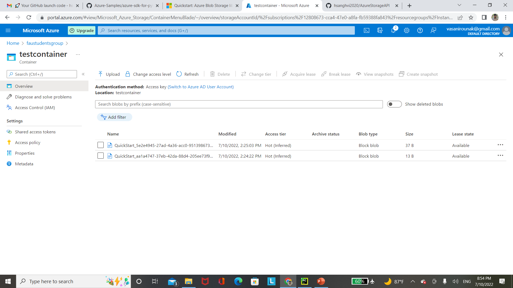

# How to upload and download blobs from Azure Blob Storage with Python

## This sample shows how to do the following operations of Storage Blobs with Storage SDK
- Create a new container on specified Azure Storage Account
- Creates a test file in user-specified folder on local system
- Uploads test file to blob storage
- Lists the blobs in the container
- Downloads the blob with a new name

## Prerequisites

If you don't have an Azure subscription, create a [free account](https://azure.microsoft.com/en-us/free/?WT.mc_id=A261C142F) before you begin.

### Create a Storage Account using the Azure Portal

**Step 1 : Create a new general-purpose Storage Account to use for this tutorial.** 
 
*  Go to the [Azure Portal] and log in using your Azure account. 
*  Select **New** > **Storage** > **Storage account**. 
*  Select your Subscription. 
*  For `Resource group`, create a new one and give it a unique name. 
*  Enter a name for your storage Account.
*  Select the `Location` to use for your Storage Account.
*  Set `Account kind` to **StorageV2(general purpose v2)**.
*  Set `Performance` to **Standard**. 
*  Set `Replication` to **Locally-redundant storage (LRS)**.
*  Set `Secure transfer required` to **Disabled**.
*  Check **Review + create** and click **Create** to create your Storage Account. 
 


**Step 2 : Copy and save Connection string.**

After your Storage Account is created. Click on it to open it. 
Select **Settings** > **Access keys** > **Key1/key**, copy the associated **Connection string** to the clipboard, then paste it into a text editor for later use.


**Step 3 : Put the connection string in an environment variable**

This solution requires a connection string be stored in an environment variable securely on the machine running the sample. Follow one of the examples below depending on your operating system to create the environment variable. If using Windows close your open IDE or shell and restart it to be able to read the environment variable.

Linux

```bash
export AZURE_STORAGE_CONNECTIONSTRING="<YourConnectionString>"
```

Windows

```cmd
setx AZURE_STORAGE_CONNECTIONSTRING "<YourConnectionString>"
```

### Set up

First, clone the repository on your machine:

```bash
git clone https://github.com/hsanghvi2020/AzureStorageAPI.git
```

Then, install the dependencies:

```bash
pip install -r requirements.txt
```

Finally, execute the following command to run this sample:
```bash
python example.py
```

### Expected Output



### Links/References
- Refer to [screenshots](./Images) for steps to create Azure Storage Account and general use of Azure Portal
- [Microsoft Azure Storage](https://pypi.org/project/azure-storage/)
- [Azure Portal](https://portal.azure.com)
- [Azure Free account](https://azure.microsoft.com/free/?WT.mc_id=A261C142F)
- [Quickstart: Manage blobs with Python v12 SDK](https://docs.microsoft.com/en-us/azure/storage/blobs/storage-quickstart-blobs-python)
- [Python Demo of Azure Storage API](https://github.com/Azure-Samples/azure-sdk-for-python-storage-blob-upload-download)
